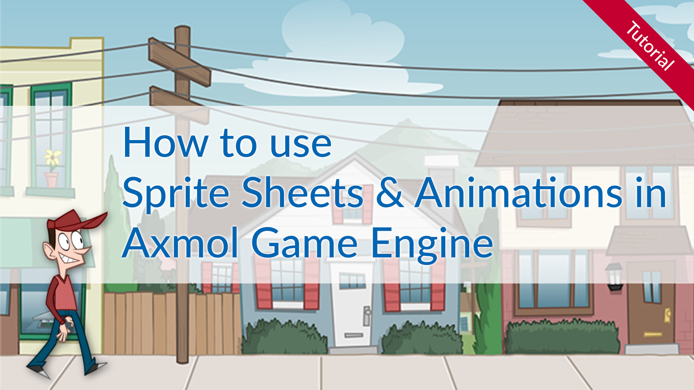

# How to use sprite sheet animations in Axmol Game Engine

This is the example code for the Axmol Game Engine Spritesheet and animations tutorial.

You learn 

- How to use sprite sheets in Axmol Game Engine
- How to create sprite sheets using TexturePacker

Read the complete tutorial here:

[Using sprite sheet animations in Axmol Game Engine](https://www.codeandweb.com/texturepacker/tutorials/animations-and-spritesheets-in-axmol-game-engine)
